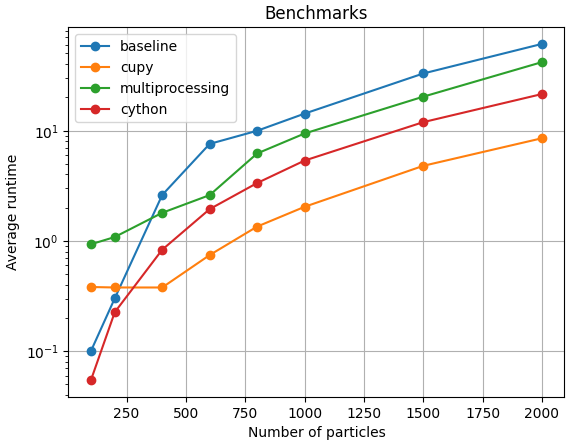

# sph-python
Optimizations of Smoothed-Particle Hydrodynamics simulation of Toy Star

## Optimizations

3 optimizations were implemented during this project:

- Cython
- Multiprocessing
- Cupy

## Install

```bash
python -m venv venv
source venv/bin/activate

pip install -r requirements.txt
```

Install cupy for your cuda version. For cuda version 12.x:

```bash
pip install cupy-cuda12x
```

## Usage

### Cython

Build the cython code:

```bash
python setup.py build_ext --inplace
```

Import the sph_core in python script to run.

### Multiprocessing

```bash
python sph_multiprocessing.py
```

### Cupy


```bash
python sph_cupy.py
```

## Profiling

Profiling of the baseline `sph.py` and documentation of profiling is done in the `profiling.ipynb` jupyter notebook. Profiling is done with cProfile, line profiler and memory profiler.

## Benchmarks

Benchmarks of the baseline and optimizations are done in the `benchmarks.ipynb`. To benchmark and compare the optimizations we measure the runtime with different number of particles, then plot the results.



Benchmarks ran on system with:

- NVIDIA RTX 3070 gpu
- AMD Ryzeen 5600x 6 core cpu
- 16 gb ram

## Correctness

Validation of correctness is done in `benchmarks.ipynb`


### Philip Mocz (2020) Princeton University, [@PMocz](https://twitter.com/PMocz)

### [📝 Read the Algorithm Write-up on Medium](https://philip-mocz.medium.com/create-your-own-smoothed-particle-hydrodynamics-simulation-with-python-76e1cec505f1)

Simulate a toy star with SPH

Running the baseline:
```
python sph.py
```
